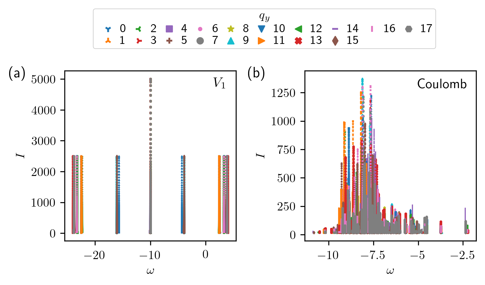

response_functions
==================

Script files for the spectral response project.

Getting started
---------------

The following commands are defined in `~/.bash_aliases`:

- ``alias TwoBodyGeneric=~/DiagHam_latest/build/FQHE/src/Programs/FQHEOnTorus/FQHETorusFermionsTwoBodyGeneric``
- ``alias Coulomb=~/DiagHam_latest/build/FQHE/src/Programs/FQHEOnTorus/FQHETorusFermionsCoulomb``
- ``alias SpectralResponse=~/DiagHam_latest/build/FQHE/src/Programs/FQHEOnTorus/FQHETorusSpectralResponse``
- ``alias SpectralResponse_newest=~/DiagHam_newest/trunk/build/FQHE/src/Programs/FQHEOnTorus/FQHETorusSpectralResponse``
- ``function gs() { cat $1 | sort -g -k2 | head }``

Note that the ``FQHETorusFermions`` and ``FQHETorus`` command prefixes have been dropped, for brevity.

The spectral functions are generated in 3 steps.

1) A pseudopotential file needs to be generated to describe the interaction. For the V1 interaction, we use the file ``pseudopotentials_V1.dat``. For the Coulomb interaction, we can use the file ``pseudopotentials_CoulombPlane.dat``. For the Yukawa interaction (with lambda=1), we can use the file ``pseudopotentials_YukawaPlaneL1.dat``. These files are found in the directory ``pseudopotentials``.

2) The lowest eigenvectors need to be computed in each ``k`` momentum sector. To this end, we may use either the ``TwoBodyGeneric`` program and specify a ``pseudopotential-file``, or the ``Coulomb`` program and specify a ``perturbation-file``. We avoid the use of pseudopotential files by using the ``Coulomb`` program for the Coulomb and Yukawa interactions, where possible. We also avoid using the ``Coulomb`` program with ``coulomb-strength 0``, since this is unintuitive.

For the V1 interaction, we use the command:

- ``TwoBodyGeneric -p 6 -l 18 --interaction-name V1 --interaction-file ../../pseudopotentials/plane/pseudopotentials_V1.dat -g --use-lapack --eigenstate -n 1``

For the Coulomb interaction, we use the command:

- ``Coulomb -p 6 -l 18 --landau-level 0 --coulomb-strength 1 -g --use-lapack --eigenstate -n 1``

For the Yukawa interaction (with lambda=1), we use the command:

- ``Coulomb -p 8 -l 24 --landau-level 0 --coulomb-strength 1 --yukawa-mass 1 -g --use-lapack --eigenstate -n 1``

These files are found in the directory ``vectors``.

3) The spectral response functions need to be computed in each ``q`` momentum sector for a ground-state eigenvector. The ground-state ``k`` sectors can be determined by examining the many-body energy spectrum:

-	``gs *.dat``

By convention, we take the first of these ground states. We then compute the spectral response function for this ground state, specifying epsilon, the range and resolution of omega, as well as the resolution of S.

- ``cd FQHETorusSpectralResponse``

For the V1 interaction, we use the command:

- ``cd laughlin``
- ``SpectralResponse ../../vectors/laughlin/fermions_torus_kysym_V1_n_6_2s_18_ratio_1.000000_ky_3.0.vec --sr-omega-min -100 --sr-omega-max 100 --sr-epsilon 1E-4 --sr-omega-interval 1E-5 --sr-spectral-resolution 1E-5 --interaction-name V1 --interaction-file ../../pseudopotentials/plane/pseudopotentials_V1.dat``

For the Coulomb interaction, we use the command:

- ``cd coulomb``
- ``SpectralResponse ../../vectors/coulomb/fermions_torus_kysym_coulomb_n_6_2s_18_ratio_1.000000_ky_3.0.vec --sr-omega-min -100 --sr-omega-max 100 --sr-epsilon 1E-4 --sr-omega-interval 1E-5 --sr-spectral-resolution 1E-5 --use-coulomb --coulomb-strength 1``

For the Yukawa interaction (with lambda=1), we use the command:

- ``cd yukawa``
- ``SpectralResponse ../../vectors/yukawa/fermions_torus_kysym_yukawa-1_plus_V1_scale_0_n_6_2s_18_ratio_1.000000_ky_3.0.vec --sr-omega-min -100 --sr-omega-max 100 --sr-epsilon 1E-4 --sr-omega-interval 1E-5 --sr-spectral-resolution 1E-5 --use-coulomb --coulomb-strength 1 --yukawa-mass 1``

4) After the spectral response functions have been generated in the ``FQHETorusSpectralResponse``, we can extract the largest 10,000 values from the files and place them in ``stripped_files`` (with a flat directory structure).

- ``strip_files.sh``

This makes the spectral response functions amenable to plotting.

5) We can then plot the spectral response functions by running e.g. ``sr.py``.

Benchmarking for the sphere
---------------------------

References
----------

`[Andrews2022] <https://arxiv.org/abs/2201.04704>`__ "Self-similarity of spectral response functions for fractional quantum Hall states with long-range interactions", by Bartholomew Andrews and Gunnar Möller, arXiv (2022).
